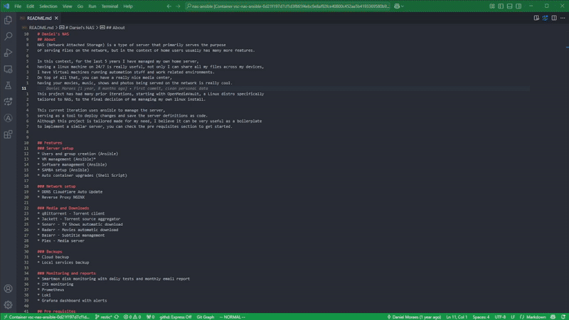
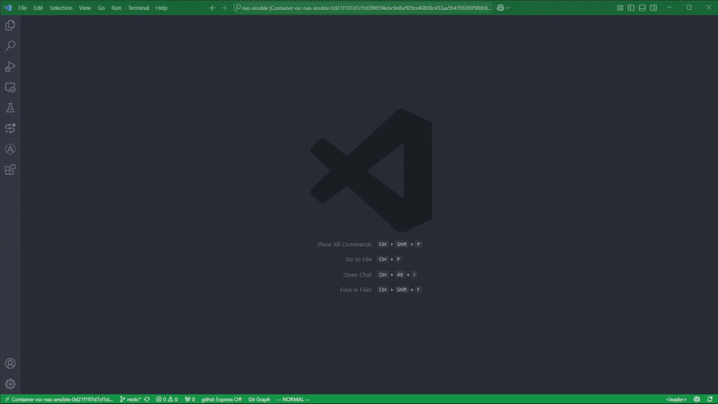

# tui-essentials - VSCode Extension

Integrate *Ranger*, *LazyGit* and *Television* into your VSCode workflow.

## Features
* Replace the default file explorer with *Ranger*
* Replace the default git interface with *LazyGit*
* Replace the default fuzzy search with *Television*

## Requirements
### Binaries
The following binaries must be available in your PATH:
* [Ranger](https://github.com/ranger/ranger)
* [LazyGit](https://github.com/jesseduffield/lazygit)
* [Television](https://github.com/alexpasmantier/television)

### Configurations
#### Ranger
To make ranger open files with vscode, add the following to your rifle.conf file
(~/.config/ranger/rifle.conf):
```bash
mime ^text = code "$@"
ext .* = code "$@"
```
## Extension Commands

The extension don't provide any default keybindings.
You can add your own keybindings to the following commands in the keybindings.json file.
* 'tui-essentials.launchRanger' - Launch Ranger in the termianl panel
* 'tui-essentials.runTaskAndClosePanel' - Helper function to run a task and close the terminal panel after it finishes

## Demo
### Lazygit

### Television

### Ranger


## Release Notes

### 0.0.1
Initial release of the extension.
